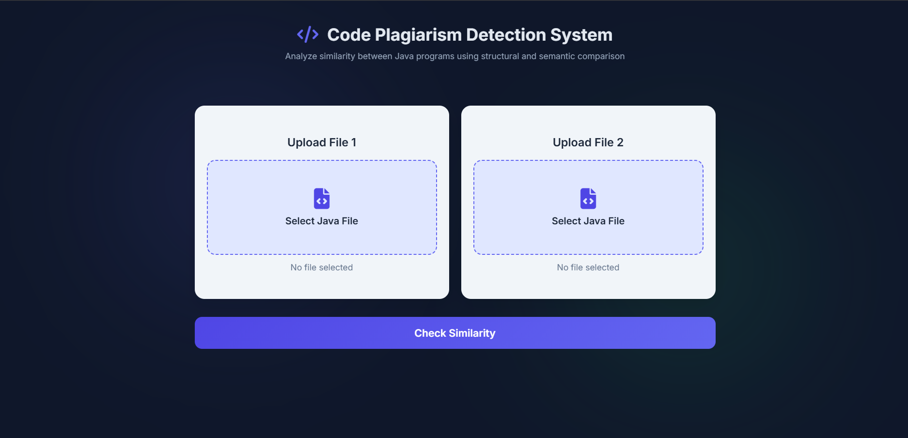
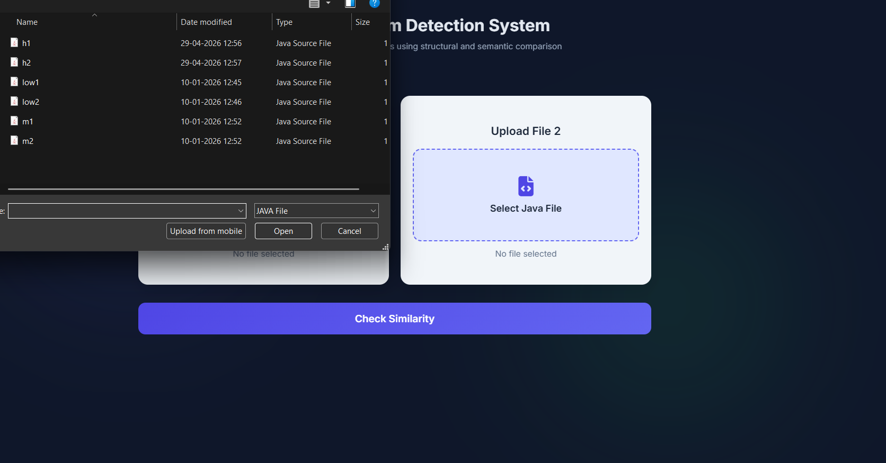
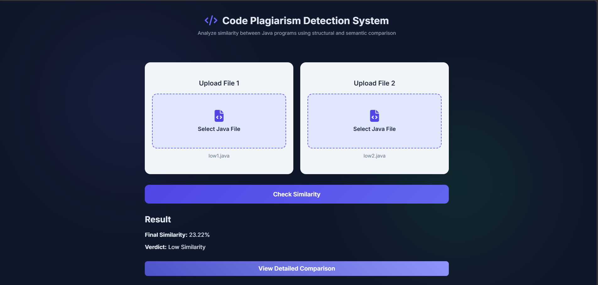
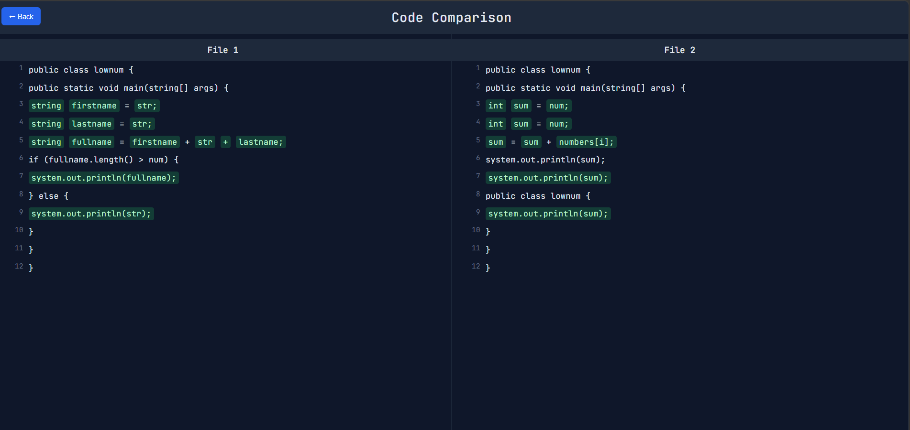

# 💻 ByteShield : Automated Code Integrity & Plaglarism Detection Platform

A web-based system that detects similarity between Java programs using **structural, statistical, and semantic analysis**.

---

## 🚀 Features

- 🔍 Token-based similarity (Jaccard Similarity)
- 📊 Text similarity using TF-IDF + Cosine Similarity
- 🌳 AST-based structural comparison (Java parsing)
- 🧠 Optional semantic similarity using embeddings
- 📄 Line-by-line code comparison
- 🎨 Side-by-side visual diff (VS Code style UI)
- ⚡ Optimized performance with conditional analysis

---

## 🛠 Tech Stack

- **Frontend:** HTML, CSS, JavaScript  
- **Backend:** Python (Flask)  
- **Libraries Used:**
  - scikit-learn
  - javalang
  - sentence-transformers (optional)
  - difflib

---

## ⚙️ How It Works

1. **Preprocessing**
   - Removes comments
   - Normalizes numbers and strings

2. **Similarity Analysis**
   - Token similarity (Jaccard)
   - TF-IDF + Cosine similarity
   - AST structural comparison

3. **Semantic Layer (Optional)**
   - Uses embeddings for logical similarity

4. **Final Score**
   - Weighted combination of all techniques

5. **Visualization**
   - Side-by-side comparison
   - Highlights meaningful code similarities

---

## 📂 Project Structure

Plagiarism_Detector/
│
├── app.py # Flask backend
├── requirements.txt # Dependencies
├── README.md
│
├── templates/ # HTML files
│ ├── index.html
│ └── details.html
│
├── static/ # CSS & JS
│ ├── style.css
│ └── script.js
│
├── sample_code/ # Test Java files

---

## ⚙️ Quick Setup (Copy & Run)

```bash
# Clone the repository
git clone https://github.com/codewithmesania/code-plagiarism-detector.git
cd code-plagiarism-detector

# Create virtual environment (Windows)
python -m venv venv
venv\Scripts\activate

# Install dependencies
pip install -r requirements.txt

# Run the project
python app.py
```

## 🌐 Open in Browser

http://127.0.0.1:5000

## 🧪 How to Use

1. Upload two Java files  
2. Click **Check Similarity**  
3. View similarity score and verdict  
4. Click **View Detailed Comparison**  
5. Analyze highlighted logic differences  


## 📊 Output

- Similarity Score (%)  
- Verdict:
  - Low → Different code  
  - Medium → Partial similarity  
  - High → Strong similarity  
- Visual side-by-side comparison  

## 📸 Screenshots

### 🏠 Home Page


### 📂 File Upload


### 📊 Result


### 🔍 Detailed Comparison



